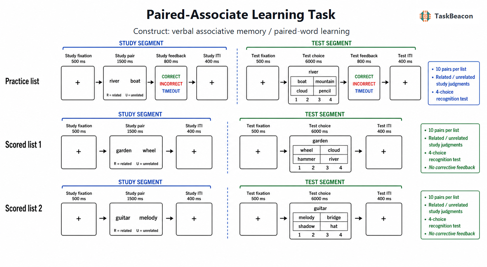

# 言语配对联想学习：关联绑定、线索提取及其测量边界

人类记忆研究需要区分单个项目被识别的熟悉感与两个项目之间新关系的形成和提取。配对联想学习（paired-associate learning, PAL）通过规定“线索—目标”配对，并在学习后仅呈现线索以要求恢复目标，把关联记忆转化为可控制的实验操作。正确反应因而要求参与者保留配对关系，而不能只依靠对单词本身的熟悉感。该范式同时具有高度可变性：材料可为词—词、面孔—姓名、物体—位置或外语—母语；提取可采用自由生成、再认或多轮学习；间隔、反馈和语义关系又会改变编码与提取策略。PAL 的理论价值来自这种可分解性，其解释风险也源于同一特征。本文以言语 PAL 为中心，论述其历史起点、实验逻辑、行为与神经证据、主要应用和测量边界，并说明 TaskBeacon 当前行为实现。

## 1. 范式提出与理论背景

Calkins（1894）用成对呈现的颜色与数字考察频次、近因性和鲜明性等条件对联想形成的影响，奠定了“正确联想法”的基本操作：先建立项目之间的特定关系，再以一项为线索检验另一项。后来的标准形式通常将一列项目任意指定为刺激、另一列指定为反应，并以正确回忆数或达到学习标准所需轮次描述习得。该操作把联结学习从无约束的自由联想中分离出来，也允许研究刺激相似性、反应相似性、呈现方式和练习程序如何改变学习曲线（Battig & Brackett, 1964）。

现代研究不再把 PAL 成绩等同于单一刺激—反应联结强度。学习一个新词对至少要求项目加工、跨项目绑定、线索驱动搜索和反应生成；延迟测验还加入保持与巩固。海马依赖的关系绑定是言语 PAL 的重要成分，但具体成绩同时受语言知识、工作记忆、策略和测验形式影响。Clark 等人（2018）进一步表明，典型言语材料常以高意象性的具体名词为主，场景或物体意象可以增强编码；“言语 PAL 激活海马”因此不能直接归结为抽象的绑定过程。范式的适当理论单位是特定材料、阶段和对比，而非一个无条件成立的“关联记忆能力”。

## 2. 任务逻辑、流程与核心参数

经典 PAL 包含学习与线索测验两个基本阶段。学习阶段逐对呈现线索与目标，参与者按指导形成二者的联系；测验阶段呈现线索，要求生成或选择原目标。多轮版本交替进行学习和测验，直至达到正确率标准或完成固定轮次，由各轮正确率、学习斜率及达到标准的轮次反映习得效率。延迟测验在数分钟、数小时或更长间隔后重复线索提取，用于估计保持；反馈通常置于练习或再学习阶段，使错误反应之后仍能接触正确目标。Nelson 和 Dunlosky（1994）对 100 个斯瓦希里语—英语配对提供了三轮线索回忆规范，显示项目难度从近乎不能回忆到接近满分。材料校准是控制天花板、学习率和条件可比性的必要环节。

自由或键入式线索回忆对目标表征与反应生成要求较高；强迫选择再认降低生成负担，并可能由目标熟悉感、排除策略或诱饵特征支持。原配对、重组配对与全新配对的再认设计可进一步区分关系记忆与项目熟悉性，但两者仍非过程纯测量。Greve 等人（2011）以强、弱语义关系以及原配对、重组配对和新配对构造对比，说明只有把编码条件与后续记忆结果结合，才可能讨论回想和熟悉性的相对贡献。因而，不同提取格式的正确率不能直接互换，四选一正确率的机会水平为 25%，也不等同于无提示回忆能力。

关键自变量包括线索与目标的语义相关性、词频、具体性、意象性、目标可记忆性、配对方向、呈现时长、列表长度、学习—测验间隔、重复次数及反馈。主要因变量包括即时和延迟正确率、反应时、侵入错误、学习曲线与遗忘量。相关配对通常可利用既有语义结构形成精细编码，任意配对则更集中地要求建立新关系；但“相关—无关”差异同时包含语义启动、加工流畅性和策略可用性的变化。Serra 和 DeYoung（2023）发现，所谓有生性效应可由配对内部关系差异解释，提示单词类别效应必须在项目层面控制。环境背景也会成为附加线索：相同屏幕背景下重复学习可促进词汇及面孔—姓名配对成绩，但这种收益并不证明核心配对表征更强（Isarida et al., 2021）。

## 3. 主要行为与神经科学发现

### 3.1 关联形成、提取与项目属性

PAL 的稳定群体效应是成绩随有效学习—测验经验增加而上升，但上升幅度取决于项目与参与者之间的匹配。Atri 等人（2004）在多轮词对任务中发现，中枢胆碱能受体阻断损害新列表学习并增加前摄干扰，支持胆碱能状态与新关联编码、旧关联竞争之间存在联系。该药理操控没有把 PAL 化约为单一神经递质指标；注意、反应效率和基线记忆同样可能影响总分。

项目本身具有可重复的可记忆性。Xie 等人（2020）结合大样本行为、计算建模与颅内记录发现，一些目标词跨线索和参与者更易被提取，正确提取更快，提取失败时却更易成为侵入反应。目标可记忆性与前颞叶较早的神经活动重现相关。这一结果表明，正确率同时反映配对强度和目标在语义记忆中的可达性。近年的规范化工作据此转向项目级校准；Fan 等人（2025）为 200 个斯瓦希里语—汉语配对报告回忆率、反应时、错误、信心、学习判断及多项词汇属性，为中文样本的难度匹配和跨文化比较提供了直接材料。

PAL 也是受控词汇学习模型。Neveu 和 Kaushanskaya（2023）比较配对学习与跨情境学习后发现，言语工作记忆和词形熟悉度对两种学习方式的作用不同，说明配对成绩不能脱离学习者已有语言表征解释。语义关系还可能使不同学习事件形成相互依赖：新信息可通过与旧配对的意义联系改变延迟记忆，而这种作用取决于关系强度与测验顺序（Antony et al., 2022）。因此，语义相关配对不是任意配对的“容易版”，二者允许利用的表征不同。

### 3.2 fMRI 与电生理证据

功能磁共振成像（functional magnetic resonance imaging, fMRI）较一致地支持内侧颞叶参与关联编码与线索提取。Meltzer 和 Constable（2005）在同一实验中比较新旧词对编码、后续记忆成功以及线索回忆成功，观察到海马形成中编码成功与回忆成功效应部分重叠。这支持相同解剖系统参与关系形成与恢复，但血氧水平依赖信号的重叠不能证明同一神经计算，也不能确定海马活动对行为具有因果作用。Greve 等人（2011）的结果提示前海马活动更接近支持回想的编码过程，而鼻周皮层活动与熟悉性相关；这些判断依赖后续测验分类和对比假设。Clark 等人（2018）则发现，场景词对和物体词对相较低意象抽象词对更强地招募前海马，揭示意象性是言语 PAL 研究中不可忽略的混淆来源。

脑电证据补充了关联形成的时间进程。Farshad 等人（2021）让参与者反复听取原本无语义关系的词对；测验时，新第二词相较已学第二词诱发更大的 N400，并伴随较晚的额叶正成分，且单纯项目重复不足以解释全部差异。该结果支持稳定共现逐步改变第二词在第一词背景下的可预测性。其任务采用听觉、偶然学习和高次数重复，N400 差异不能直接等同于 TaskBeacon 所用视觉有意学习中的关系绑定强度。

颅内脑电（intracranial EEG, iEEG）进一步显示成功记忆涉及跨区域时变协调。Phan 等人（2024）在词对编码和口头线索回忆中发现，成功形成各个配对时出现项目特异的亚秒级功能连接变化，成功提取同一配对时相应模式再次出现。该证据把重现从局部活动扩展到动态连接，但样本来自接受癫痫监测的患者，电极覆盖由临床需要决定，不能据此推断健康人全脑网络的完整空间分布。

## 4. 范式发展与主要应用

PAL 的应用集中在发展、语言学习和临床神经心理学。儿童期关系记忆、策略使用和语言表征仍在发展，任务材料及反应方式必须适龄。Hulme 等人（2007）发现儿童的视觉—言语配对学习与阅读发展相关，而对语音意识进行统计控制后，配对学习仍具有独立预测信息；该关联支持 PAL 作为新正字法—语音映射学习的模型，不足以证明其单独决定阅读能力。Buck 等人（2021）开发的平板 Pair Test 在同一工具内比较言语与非言语学习、延迟回忆和再认，8—18 岁样本表现出发展敏感性及与标准记忆测验的收敛关系，使 PAL 从单次实验指标扩展为过程分解式评估。

在老化与神经疾病研究中，词对学习常用于检测内侧颞叶相关记忆变化。非痴呆老年人中，APOE 基因型相关的行为与 fMRI 差异曾被解释为右半球代偿反应（Han et al., 2007），但横断面组间活动差异既可能反映代偿，也可能反映任务难度或效率变化。临床解释应结合年龄、教育、语言、感觉运动能力和独立量表；PAL 群体差异不能单独承担个体诊断。数字化和远程化提高了重复测量的可行性，同时使设备、环境控制、输入方式和无人监督依从性成为新的误差来源。

## 5. 测量效度与解释边界

PAL 具有明确的操作效度：只呈现线索而要求恢复指定目标，较单项目测验更直接地要求利用关系信息。其构念效度仍取决于设计。相关词对可依赖既有语义知识，无关词对更易受意象策略和工作记忆限制；自由回忆、再认和重新配对判断对回想、熟悉性及反应生成的权重不同；即时成绩混合编码与提取，延迟成绩又受到初始学习水平影响。研究应预先界定主要终点，并同时报告材料属性、机会水平、超时、错误类型及学习轮次，避免用一个总正确率概括所有记忆阶段。

可靠性也需要在具体指标上判断。Buck 等人（2021）的 Pair Test 在相隔约 14 个月时各指标呈中等重测一致性，其中延迟回忆的组内相关系数约为 .73；这一结果不能自动推广到更短、项目更少或仅有单轮再认的版本。学习任务重复施测会产生材料记忆和策略熟练，平行形式若未在项目难度上校准，也会把表单差异误作个体变化。稳定的群体平均效应不保证个体排序可靠。列表长度不足、天花板或地板效应以及相关项目比例过高都会进一步压缩个体差异。

神经指标同样不是过程标签。海马 fMRI 差异可能混合新颖性、意象、难度与成功记忆；N400 对语义预期和重复均敏感；iEEG 的空间抽样受临床布极限制。较稳妥的推断应把神经差异限定为特定条件与阶段相关活动，并以行为表现、刺激规范及独立操控约束解释。现有证据支持 PAL 研究关联记忆的群体机制与发展变化，尚不足以仅凭一次短测验完成病因判断或临床分类。

## 6. TaskBeacon 中的任务实现

### 6.1 任务资源与访问入口

| 资源 | ID | 用途 | 地址 |
|---|---|---|---|
| 完整行为任务源码 | T000051 | PsychoPy/PsyFlow 本地实验实现 | https://github.com/TaskBeacon/T000051-paired-associate-learning-task |
| 浏览器伴随版源码 | H000051 | 保留同一任务流程的网页行为预览（draft） | https://github.com/TaskBeacon/H000051-paired-associate-learning-task |
| 在线体验 | H000051 | 在共享 `psyflow-web` 运行器中体验浏览器版 | https://taskbeacon.github.io/psyflow-web/?task=H000051-paired-associate-learning-task |

T000051 是英文行为采集实现；H000051 是其浏览器伴随版，公开清单将其标记为 `behavior`、`draft`。二者均保留学习关系判断、四选一关联再认、练习反馈和列表总结。浏览器版适合流程预览与网页行为运行，不涉及额外的 EEG、fMRI 或临床采集硬件。

### 6.2 实现流程与关键参数

**图 1. TaskBeacon 当前版本的列表与试次流程。** 任务依次运行 1 个练习列表和 2 个计分列表，每表含 10 对英文词，其中语义相关与无关配对各 5 对，且不同列表使用互不重叠的材料。每表先完成全部学习试次，再完成全部测验试次。学习试次为注视 500 ms、词对与关系判断窗口 1500 ms、试次间隔 400 ms；参与者按 `R` 判断相关、按 `U` 判断无关。练习表随后呈现正确、错误或超时反馈 800 ms，计分表无逐试次反馈。测验试次为注视 500 ms、四选一窗口 6000 ms、试次间隔 400 ms；屏幕以线索词和同表 4 个候选目标构成 2×2 网格，按 `1`—`4` 选择原配对目标，正确位置和三个诱饵由固定种子决定。练习测验提供 800 ms 纠正反馈。该实现没有自适应控制器，不依据在线表现调整难度或时限。

| 实现要素 | 当前设置 | 解释相关性 |
|---|---|---|
| 列表结构 | 练习 1 表、计分 2 表；每表 10 对 | 共 30 对，各表形成独立学习—测验单元 |
| 学习条件 | 相关/无关各半；`R`/`U` | 关系判断促进对词义关系的加工，同时使两类配对的编码操作不同 |
| 提取格式 | 4 选 1 再认；6 s | 主要终点为测验正确率与正确反应时，不等同于自由线索回忆 |
| 反馈 | 仅练习表，学习与测验各 0.8 s | 用于熟悉规则；计分表避免逐试次纠正改变后续材料 |
| 排序与诱饵 | 总种子 51051；确定性排序 | 便于复现，但同一版本重复施测可能产生材料与位置记忆 |
| 自适应 | 无 | 不会把参与者维持在共同难度水平 |

TaskBeacon 当前版本记录学习判断和测验选择的正确性、反应时与超时，并汇总学习正确率、测验正确率、平均正确测验反应时和超时数。学习阶段的“正确率”是语义相关性判断准确率，不是配对是否已被记住；研究关联记忆时应以随后四选一成绩为核心，并把学习判断作为编码操作及依从性信息。相关与无关词来自预设词库，未附带独立的词频、具体性、意象性和规范化关联强度，因此该版本适合展示受控流程，不宜在缺少额外材料规范的情况下把条件差异完全归因于关联绑定。

## 参考文献

Antony, J. W., Romero, A., Vierra, A. H., Luenser, R. S., Hawkins, R. D., & Bennion, K. A. (2022). Semantic relatedness retroactively boosts memory and promotes memory interdependence across episodes. *eLife, 11*, e72519. https://doi.org/10.7554/eLife.72519

Atri, A., Sherman, S., Norman, K. A., Kirchhoff, B. A., Nicolas, M. M., Greicius, M. D., Cramer, S. C., Breiter, H. C., Hasselmo, M. E., & Stern, C. E. (2004). Blockade of central cholinergic receptors impairs new learning and increases proactive interference in a word paired-associate memory task. *Behavioral Neuroscience, 118*(1), 223–236. https://doi.org/10.1037/0735-7044.118.1.223

Battig, W. F., & Brackett, H. R. (1964). The influence of training procedure and other task variables in paired-associate learning. *Journal of Verbal Learning and Verbal Behavior, 3*(1), 70–76. https://doi.org/10.1016/S0022-5371(64)80060-8

Buck, S., Bastos, F., Baldeweg, T., & Vargha-Khadem, F. (2021). The Pair Test: A computerised measure of learning and memory. *Behavior Research Methods, 53*(2), 928–942. https://doi.org/10.3758/s13428-020-01470-9

Calkins, M. W. (1894). Association. *Psychological Review, 1*, 476–483.

Clark, I. A., Kim, M., & Maguire, E. A. (2018). Verbal paired associates and the hippocampus: The role of scenes. *Journal of Cognitive Neuroscience, 30*(12), 1821–1845. https://doi.org/10.1162/jocn_a_01315

Fan, T., Zhao, W., Sun, B., Liu, S., Yin, Y., Xu, M., Hu, X., Yang, C., & Luo, L. (2025). A normative database of Swahili–Chinese paired associates. *Behavior Research Methods, 57*, Article 40. https://doi.org/10.3758/s13428-024-02531-z

Farshad, M., Pavlov, Y. G., & Kotchoubey, B. (2021). Event-related potentials in an associative word pair learning paradigm. *Journal of Neurolinguistics, 59*, Article 101001. https://doi.org/10.1016/j.jneuroling.2021.101001

Greve, A., Evans, C. J., Graham, K. S., & Wilding, E. L. (2011). Functional specialisation in the hippocampus and perirhinal cortex during the encoding of verbal associations. *Neuropsychologia, 49*(9), 2746–2754. https://doi.org/10.1016/j.neuropsychologia.2011.06.002

Han, S. D., Houston, W. S., Jak, A. J., Eyler, L. T., Nagel, B. J., Fleisher, A. S., Brown, G. G., Corey-Bloom, J., Salmon, D. P., Thal, L. J., & Bondi, M. W. (2007). Verbal paired-associate learning by APOE genotype in non-demented older adults: fMRI evidence of a right hemispheric compensatory response. *Neurobiology of Aging, 28*(2), 238–247. https://doi.org/10.1016/j.neurobiolaging.2005.12.013

Hulme, C., Goetz, K., Gooch, D., Adams, J., & Snowling, M. J. (2007). Paired-associate learning, phoneme awareness, and learning to read. *Journal of Experimental Child Psychology, 96*(2), 150–166. https://doi.org/10.1016/j.jecp.2006.09.002

Isarida, T., Isarida, T. K., Kubota, T., Yin, Y., Sakakibara, I., & Kato, D. (2021). Facilitation effect of incidental environmental context on the computer screen for paired-associate learning. *Quarterly Journal of Experimental Psychology, 74*(9), 1562–1570. https://doi.org/10.1177/17470218211011005

Meltzer, J. A., & Constable, R. T. (2005). Activation of human hippocampal formation reflects success in both encoding and cued recall of paired associates. *NeuroImage, 24*(2), 384–397. https://doi.org/10.1016/j.neuroimage.2004.09.001

Nelson, T. O., & Dunlosky, J. (1994). Norms of paired-associate recall during multitrial learning of Swahili-English translation equivalents. *Memory, 2*(3), 325–335. https://doi.org/10.1080/09658219408258951

Neveu, A., & Kaushanskaya, M. (2023). Paired-associate versus cross-situational: How do verbal working memory and word familiarity affect word learning? *Memory & Cognition, 51*(7), 1670–1682. https://doi.org/10.3758/s13421-023-01421-7

Phan, A. T., Xie, W., Chapeton, J. I., Inati, S. K., & Zaghloul, K. A. (2024). Dynamic patterns of functional connectivity in the human brain underlie individual memory formation. *Nature Communications, 15*, Article 8969. https://doi.org/10.1038/s41467-024-52744-1

Serra, M. J., & DeYoung, C. M. (2023). Within-pair factors might explain the inconsistent effects of animacy on paired-associates recall. *Psychonomic Bulletin & Review, 30*(2), 688–699. https://doi.org/10.3758/s13423-022-02184-z

Xie, W., Bainbridge, W. A., Inati, S. K., Baker, C. I., & Zaghloul, K. A. (2020). Memorability of words in arbitrary verbal associations modulates memory retrieval in the anterior temporal lobe. *Nature Human Behaviour, 4*(9), 937–948. https://doi.org/10.1038/s41562-020-0901-2
